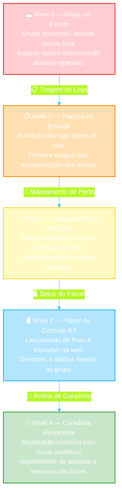

# Passo 02: A Jornada do seu Mentorado (A Transformação)

Este passo mapeia a evolução do seu cliente de mentoria desde o estado caótico inicial (antes de aplicar o método RX) até o estado final otimizado.

---

## 🗺️ O Mapa do Progresso

---

### 📊 Detalhamento das Fases

| Nível | Fase | Estado do Grupo | Sentimento do Aluno |
|:---:|:---|:---|:---|
| **0** 🔴 | **Grupo no Escuro** | Grupo silencioso, apenas postagens de avisos frios. Suporte reativo respondendo dúvidas repetidas de link. | Desorientado, isolado e sentindo que a mentoria é fraca. |
| **1** 🟠 | **Triagem de Entrada** | Extração dos logs brutos do chat. Primeira triagem manual ou com auxílio de IA das apresentações dos alunos. | Começando a perceber clareza e acolhimento organizado. |
| **2** 🟡 | **Mapeamento de Sinergias** | Geração do banco de dados (nicho, localização, redes sociais). Mapeamento das pontes de negócios entre membros. | Surpreso ao descobrir quem são seus pares na turma. |
| **3** 🔵 | **Painel de Controle RX** | Lançamento oficial do link do Raio-X interativo na web. Fixação das diretrizes e atalhos na descrição do grupo. | Orientado, engajado e ativo. Começa a usar a rede. |
| **4** 🟢 | **Curadoria Recorrente** | Atualização contínua (novos membros, depoimentos de sucesso de vendas, resumos pós-Zoom em tempo recorde). | Totalmente acolhido, gerando networking ativo e feedbacks. |

---

## 📈 Os Resultados Tangíveis da Jornada

Ao final desta jornada, o mentorado terá alcançado:

1. **Redução de 70% no suporte básico:** Dúvidas comuns são sanadas pelos atalhos fixados no topo.
2. **Engajamento Espontâneo:** Os alunos interagem entre si em eixos temáticos específicos de negócios (sinergias).
3. **Métricas Claras:** O mentor sabe exatamente quantos alunos estão ativos, quantos são silenciosos, e a distribuição geográfica e profissional de sua audiência.
4. **Case de Sucesso Expostos:** Uma seção específica de depoimentos no topo do Raio-X serve como prova social contínua para futuras vendas.
