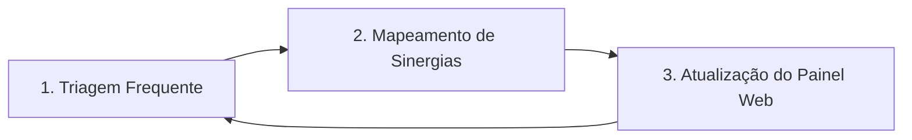

# Passo 04: Entrega, Acompanhamento e Curadoria Ativa

Este passo define as rotinas práticas de operação da comunidade otimizada para manter o grupo engajado de forma perene.

---

## 🔁 O Ciclo Ativo de Curadoria (Diário ou Dinâmico)

A curadoria da comunidade não pode ser um processo manual cansativo. Ela deve seguir este ciclo de 3 etapas dinâmicas (diárias ou 2x a 3x por semana, dependendo da movimentação):



1. **Triagem Ativa (Diária ou Dinâmica):**
   * Exportar os logs de conversa do WhatsApp.
   * Rodar o script de triagem para identificar novas apresentações de novos membros e contar a participação.
2. **Atualização de Sinergias (Frequente):**
   * Mapear novos nichos e cruzar dados com participantes antigos.
   * Se um novo participante trabalha em um segmento afim, adicioná-lo à respectiva sinergia (ex: grupo de saúde, tecnologia, dados, ou educação).
3. **Resumo Pós-Aulas Zoom (Padrão Ouro):**
   * Assim que terminar um encontro ao vivo da turma, obter a transcrição gerada pelo Zoom/Teams.
   * Passar a transcrição em um prompt de IA com a diretriz do método para gerar:
     * Título conceitual do encontro.
     * Tópicos discutidos e dúvidas principais respondidas.
     * Tarefa prática com prazos (se houver).
     * Links importantes e atalhos de rotina.
   * Publicar o resumo e fixar na descrição do WhatsApp em até 2 horas pós-encontro.

---

## 📜 Roteiro de Descrição do WhatsApp Otimizado

Um componente vital da entrega é redesenhar a descrição do grupo de WhatsApp do seu cliente. Ela deve seguir o modelo de "Atalhos de Conversão":

```markdown
🚀 Bem-vindos à Mentoria [Nome]!
📅 Última atualização do Raio-X: DD/MM/AAAA às HH:MM

🌿 Painel Raio-X (Ache seus parceiros de negócios):
👉 https://[link-do-site]/raio-x/

🎓 Área de Alunos (Gravações): [Link Hotmart/Kajabi]
🤖 Atalho do Tutor/IA: [Link da IA se houver]
📞 Suporte Técnico Oficial: [Linkwa.me/número]

🤝 Diretrizes Rápidas:
1. Use o grupo para networking e tirar dúvidas conceituais.
2. É PROIBIDO divulgar links externos ou spam.
3. Poste conquistas usando o hashtag #PEI ou #VITORIA!
```
