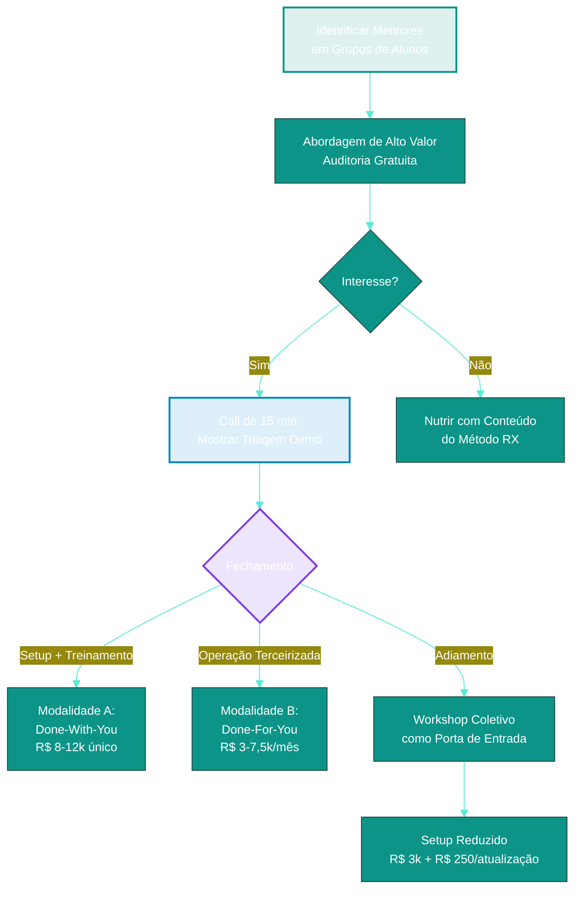
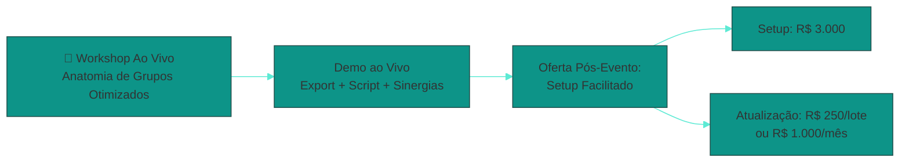

# Passo 07: Canais de Aquisição e Estratégia de Vendas

Neste passo, detalhamos a estratégia de captação ativa de clientes (prospecção B2B) baseada em auditorias gratuitas de grupos de WhatsApp.

---

## 🎯 Prospecção Ativa via Diagnóstico Gratuito (O Gancho de Entrada)

A melhor forma de vender a consultoria Comunidade Raio-X é demonstrando o valor em tempo real. Siga este roteiro de vendas:

### 1. Mapeamento de Alvos

Identifique infoprodutores e mentores que você já acompanha ou dos quais é aluno. Grupos de entrada de eventos ao vivo e mentorias em que você participa são locais ideais.

---

### ⚠️ O Desafio Técnico do Histórico do WhatsApp

Antes de disparar a abordagem, considere uma limitação técnica crítica: **novos membros que entram em um grupo de WhatsApp não têm acesso às mensagens enviadas antes do seu ingresso**. 

Se você acabou de entrar no grupo de um cliente em potencial, **não conseguirá extrair logs do histórico passado**. Para contornar essa barreira técnica, adote uma destas duas táticas:

#### 🟢 Tática A: O Cavalo de Troia (Membro Ativo)
* **Quando usar:** Em mentorias ou grupos de alunos nos quais você já está inserido como participante há algum tempo.
* **Operação:** Como você já tem as mensagens no seu próprio celular, basta fazer a exportação do arquivo `.txt` local, rodar o script e enviar a triagem pré-pronta como um presente de alto valor para o mentor.

#### 🔵 Tática B: O Gancho de Auditoria (Acesso Condicionado)
* **Quando usar:** Em grupos nos quais você não tem acesso ou acabou de ser inserido (sem histórico).
* **Operação:** Na mensagem de abordagem, em vez de enviar o relatório pronto, você solicita o log para rodar o diagnóstico gratuito:
  > *"Fala, [Nome]! Tenho um sistema de inteligência de dados que analisa a saúde operacional de comunidades. Se você ou seu suporte puderem exportar o arquivo `.txt` do grupo dos últimos 3 dias (sem mídias, garantindo 100% de privacidade dos dados) e me enviar, eu rodo um diagnóstico gratuito para expor onde o suporte perde mais tempo e quais sinergias de negócios estão ocultas. Apresento tudo em uma chamada rápida de 15 minutos."*
* **Qualificação de Leads:** Esse pedido funciona como um filtro de intenção. Se o mentor se dispõe a exportar e enviar o log, ele é um lead altamente engajado e propenso a contratar.

---

### 2. Abordagem de Alto Valor (Direct/WhatsApp)

Envie uma mensagem privada para o mentor ou gestor de comunidades:

> *"Fala, [Nome]! Tudo bem? Sou aluno da mentoria [Nome] e notei que no nosso grupo do WhatsApp tem vários profissionais fantásticos que estão 'silenciosos'. Como exercício prático de dados, eu fiz uma triagem das apresentações dos últimos 15 membros e achei 3 sinergias de negócios incríveis entre eles.*
>
> *Se você quiser, posso fazer uma auditoria rápida e gratuita dos últimos 3 dias de interações do seu grupo para te mostrar onde estão as dúvidas repetitivas que estão sugando o tempo do seu suporte e onde estão as sinergias. Topa bater um papo de 15 minutos?"*

### 3. A Call de 15 Minutos (Diagnóstico)

1. Apresente a triagem rápida que você fez (uma versão demonstrativa no GitHub Pages ou Vercel).
2. Mostre como a equipe dele perde tempo respondendo a links e como os membros perdem o histórico e contexto ao entrarem atrasados (a dor do scroll infinito).
3. **O Fechamento:**

> *"Eu posso fazer a implantação completa do Painel Web Raio-X na sua mentoria. Temos duas modalidades:*
> - *Se você tiver equipe própria e quiser autonomia, eu faço todo o setup técnico no seu GitHub/Vercel e o treinamento da sua equipe para operarem de forma independente — investimento único.*
> - *Se preferir que eu cuide de toda a operação técnica nos bastidores (rodar scripts, manter o painel atualizado com novos censos e fazer os resumos das aulas do Zoom em menos de 2h), trabalhamos com taxa de montagem + mensalidade operacional.*
>
> *Qual formato faz mais sentido para a sua estrutura?"*

> [!NOTE]
> Os valores exatos de cada modalidade estão detalhados no **[Passo 05 — Precificação](../05_PRECIFICACAO/PASSO_05_Precificacao.html)**.

---

## ⚡ Estratégia de Venda Coletiva (Workshop de 2 Horas)

Se você quiser vender em escala para múltiplos mentores e futuros gestores:

1. **O Evento:** Realize um workshop ao vivo de 2 horas no Zoom chamado: **"A Anatomia de Grupos Otimizados: Como engajar alunos e vender novos produtos via curadoria de WhatsApp"**.
2. **Demonstração Prática:** Mostre na tela como exportar logs e rodar o script para gerar sinergias ao vivo (usando os dados das apresentações dos próprios participantes do workshop!).
3. **A Oferta de Prestação de Serviços:** Em vez de vender apenas ingressos de mentoria, oferte a contratação direta do serviço sob uma modalidade de entrada facilitada para pequenos e futuros mentores:
   - **Setup de Entrada:** Taxa inicial para montagem do site no GitHub Pages/Vercel e scripts personalizados.
   - **Fração por Atualização:** Valor por lote de atualização ou mensalidade com até 4 atualizações.
   - Isso reduz a barreira de entrada técnica e financeira, garantindo receita recorrente e estabilidade operacional para quem está começando a tracionar mentorias.
