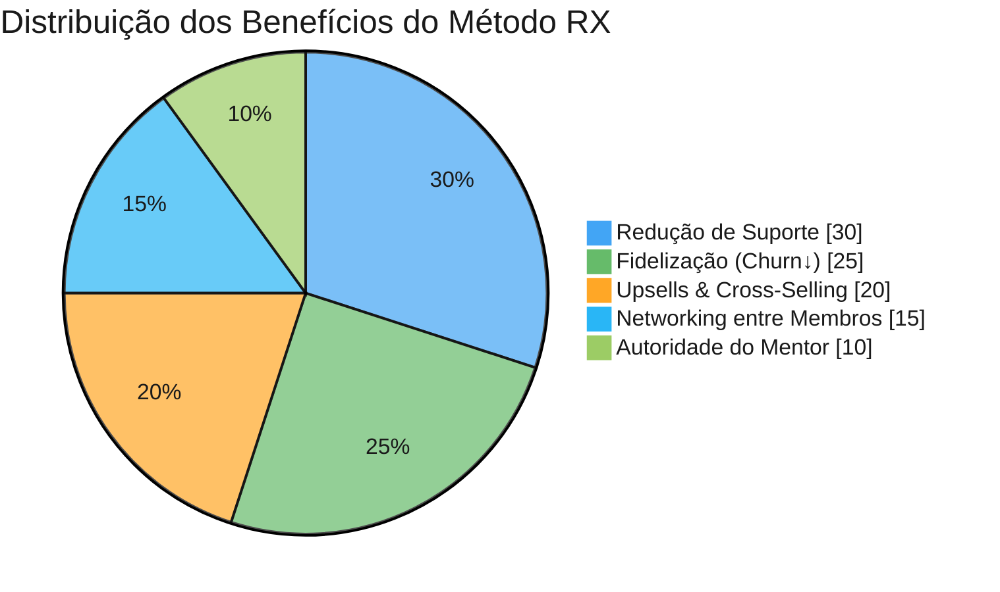
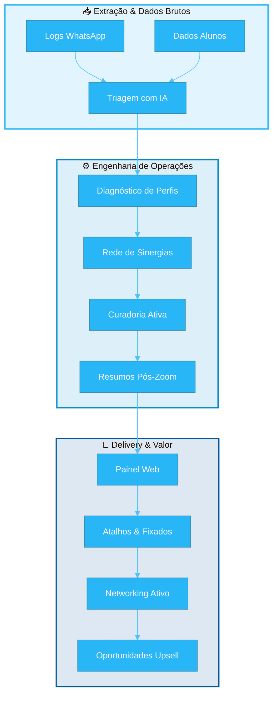
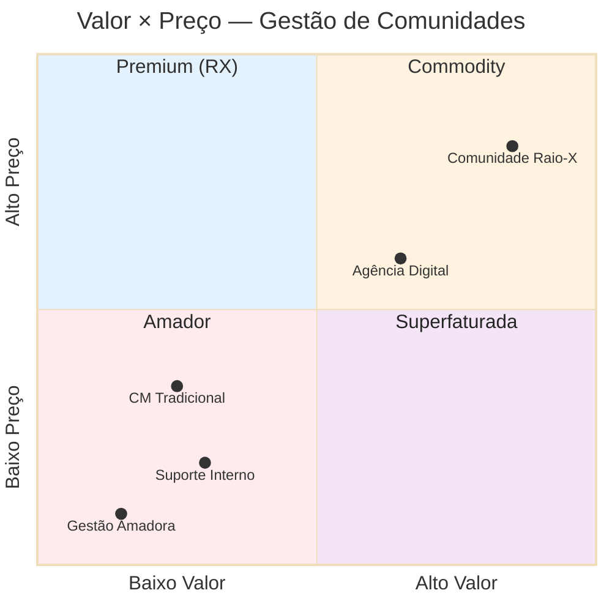

# 🔬 Comunidade Raio-X

<div class="rx-logo-header">
    
    <div>
        <strong>Comunidade Raio-X</strong><br>
        <span style="color: var(--md-default-fg-color--light, #666); font-size: 0.9rem;">Método de Gestão, Curadoria Ativa e Conversão para Grupos de WhatsApp &amp; Mentorias</span>
    </div>
</div>


---

## 📊 Painel de Impacto

<div class="rx-metrics">
    <div class="rx-mcard">
        <div class="rx-mcard-val">-70%</div>
        <div class="rx-mcard-label">Suporte Repetitivo</div>
    </div>
    <div class="rx-mcard">
        <div class="rx-mcard-val">-68%</div>
        <div class="rx-mcard-label">Churn de Alunos</div>
    </div>
    <div class="rx-mcard">
        <div class="rx-mcard-val">3,4×</div>
        <div class="rx-mcard-label">ROI no Primeiro Ano</div>
    </div>
    <div class="rx-mcard">
        <div class="rx-mcard-val">+∞</div>
        <div class="rx-mcard-label">Novas Oportunidades</div>
    </div>
</div>

### 💰 Retorno sobre Investimento (Anual)

<div class="rx-chart">
    <div class="rx-chart-title">Setup (único) × Economia Anual × Upsells</div>
    <div class="rx-chart-inner">
        <div class="rx-bar-wrap">
            <div class="rx-bar rx-bar-b1" style="height:46px">R$ 8k</div>
            <div class="rx-label">Setup<br><span class="rx-sublabel">custo único</span></div>
        </div>
        <div class="rx-bar-wrap">
            <div class="rx-bar rx-bar-b2" style="height:132px">R$ 25k</div>
            <div class="rx-label">Economia<br><span class="rx-sublabel">-70% suporte</span></div>
        </div>
        <div class="rx-bar-wrap">
            <div class="rx-bar rx-bar-b3" style="height:154px">R$ 35k</div>
            <div class="rx-label">Upsells<br><span class="rx-sublabel">novos negócios</span></div>
        </div>
    </div>
</div>

### ⏱ Carga de Suporte Semanal

<div class="rx-chart">
    <div class="rx-chart-title">Antes × Depois da Implantação do RX</div>
    <div class="rx-chart-inner">
        <div class="rx-bar-wrap">
            <div class="rx-bar rx-bar-b4" style="height:154px">12h</div>
            <div class="rx-label">Antes do RX</div>
        </div>
        <div class="rx-bar-wrap">
            <div class="rx-bar rx-bar-b2" style="height:46px">3,6h</div>
            <div class="rx-label">Com RX<br><span class="rx-sublabel">-70%</span></div>
        </div>
    </div>
</div>

### 📈 Benefícios Acumulados



---

> 🚨 **Sua comunidade de mentoria é gerida de forma reativa — ou sofre com silêncio e scroll infinito?** Descubra o ecossistema que reduz em até **70% o suporte básico** e ativa conexões de negócios entre seus membros, publicando painéis dinâmicos e resumos inteligentes direto na Web (**GitHub Pages & Vercel**).
>
> ➡️ **[Aprenda o Método](03_ESTRUTURA_FORMATO/PASSO_03_Estrutura.html)** ou **[Contrate a Operação Técnica](05_PRECIFICACAO/PASSO_05_Precificacao.html)**

---

## 🧭 O Ecossistema da Metodologia



---

## 🗺️ Timeline de Implementação

<div class="rx-timeline">
    <div class="rx-tl-phase">📋 Diagnóstico</div>
    <div class="rx-tl-item">
        <span class="rx-tl-tag rx-tag-done">Concluído</span>
        <div class="rx-tl-title">Extração de Logs Históricos</div>
        <div class="rx-tl-desc">Exportação e higienização dos logs do WhatsApp</div>
    </div>
    <div class="rx-tl-item">
        <span class="rx-tl-tag rx-tag-done">Concluído</span>
        <div class="rx-tl-title">Triagem de Perfis (IA)</div>
        <div class="rx-tl-desc">Processamento com IA para diagnóstico individual</div>
    </div>
    <div class="rx-tl-item">
        <span class="rx-tl-tag rx-tag-done">Concluído</span>
        <div class="rx-tl-title">Mapa de Sinergias Iniciais</div>
        <div class="rx-tl-desc">Cruzamento: nicho × localização × redes</div>
    </div>
    <div class="rx-tl-phase">⚙️ Infraestrutura</div>
    <div class="rx-tl-item">
        <span class="rx-tl-tag rx-tag-active">Fazendo</span>
        <div class="rx-tl-title">Setup Repositório Git</div>
        <div class="rx-tl-desc">Banco de dados estruturado no GitHub</div>
    </div>
    <div class="rx-tl-item">
        <span class="rx-tl-tag rx-tag-active">Fazendo</span>
        <div class="rx-tl-title">Deploy GitHub Pages / Vercel</div>
        <div class="rx-tl-desc">Painel interativo publicado na web</div>
    </div>
    <div class="rx-tl-item">
        <span class="rx-tl-tag rx-tag-active">Fazendo</span>
        <div class="rx-tl-title">Scripts de Curadoria</div>
        <div class="rx-tl-desc">Automação de triagem e resumos</div>
    </div>
    <div class="rx-tl-phase">🚀 Operação Contínua</div>
    <div class="rx-tl-item">
        <span class="rx-tl-tag rx-tag-future">Recorrente</span>
        <div class="rx-tl-title">Curadoria Semanal</div>
        <div class="rx-tl-desc">Atualização do painel com novos membros</div>
    </div>
    <div class="rx-tl-item">
        <span class="rx-tl-tag rx-tag-future">Recorrente</span>
        <div class="rx-tl-title">Resumos Pós-Zoom</div>
        <div class="rx-tl-desc">Resumos executivos em até 2 horas</div>
    </div>
    <div class="rx-tl-item">
        <span class="rx-tl-tag rx-tag-future">Recorrente</span>
        <div class="rx-tl-title">Relatórios de Sinergia</div>
        <div class="rx-tl-desc">Alertas de conexões estratégicas</div>
    </div>
</div>

---

## 📈 Matriz de Posicionamento



<div class="rx-mlegenda">
    <div class="rx-mleg-item"><span class="rx-mleg-dot" style="background:#1565c0"></span> <strong>Comunidade Raio-X</strong> — Alto valor, preço justo</div>
    <div class="rx-mleg-item"><span class="rx-mleg-dot" style="background:#e65100"></span> <strong>CM Tradicional</strong> — Só moderação, baixo valor</div>
    <div class="rx-mleg-item"><span class="rx-mleg-dot" style="background:#c62828"></span> <strong>Gestão Amadora</strong> — Grupo largado, perda total</div>
    <div class="rx-mleg-item"><span class="rx-mleg-dot" style="background:#6a1b9a"></span> <strong>Agência Digital</strong> — Preço alto, genérico</div>
    <div class="rx-mleg-item"><span class="rx-mleg-dot" style="background:#78909c"></span> <strong>Suporte Interno</strong> — Custo oculto, sem método</div>
</div>

---

## 🧩 Os 7 Pilares do Método

<div class="rx-pilares">
    <div class="rx-pilar rx-p1">
        <div class="rx-pilar-num">Passo 01</div>
        <div class="rx-pilar-nome">Persona</div>
        <ul><li>Diagnóstico da Dor</li><li>Perfil Ideal (ICP)</li><li>Mapeamento de Frustrações</li></ul>
    </div>
    <div class="rx-pilar rx-p2">
        <div class="rx-pilar-num">Passo 02</div>
        <div class="rx-pilar-nome">Jornada</div>
        <ul><li>Do Caos à Clareza</li><li>Pontos de Contato</li><li>Gatilhos de Engajamento</li></ul>
    </div>
    <div class="rx-pilar rx-p3">
        <div class="rx-pilar-num">Passo 03</div>
        <div class="rx-pilar-nome">Estrutura</div>
        <ul><li>Formato do Produto</li><li>Entrega Assíncrona</li><li>Stack Tecnológica</li></ul>
    </div>
    <div class="rx-pilar rx-p4">
        <div class="rx-pilar-num">Passo 04</div>
        <div class="rx-pilar-nome">Entrega</div>
        <ul><li>Curadoria Ativa</li><li>Resumos Pós-Zoom</li><li>Automação com IA</li></ul>
    </div>
    <div class="rx-pilar rx-p5">
        <div class="rx-pilar-num">Passo 05</div>
        <div class="rx-pilar-nome">Precificação</div>
        <ul><li>High Ticket</li><li>Recorrência Mensal</li><li>ROI do Cliente</li></ul>
    </div>
    <div class="rx-pilar rx-p6">
        <div class="rx-pilar-num">Passo 06</div>
        <div class="rx-pilar-nome">Oferta</div>
        <ul><li>Copy &amp; Naming</li><li>Promessa de Aceleração</li><li>Bônus Irresistíveis</li></ul>
    </div>
    <div class="rx-pilar rx-p7">
        <div class="rx-pilar-num">Passo 07</div>
        <div class="rx-pilar-nome">Aquisição</div>
        <ul><li>Auditoria Gratuita</li><li>Vendas Consultivas</li><li>Prova Social</li></ul>
    </div>
</div>

---

## 🌟 Prova Social

<div class="rx-test">
    "Depois da implantação do Raio-X, meu grupo de WhatsApp deixou de ser um depósito de avisos. Em 15 dias, dois alunos fecharam uma parceria que nunca teriam descoberto sem o mapeamento de sinergias."
    <cite>— Mentor de Alta Performance (SP)</cite>
</div>

<div class="rx-test">
    "O resumo pós-Zoom em 2 horas mudou o engajamento. Minha equipe economiza 12h por semana."
    <cite>— Infoprodutor Health &amp; Wellness (MG)</cite>
</div>

---

## 🚀 Navegue pelos 7 Passos

<div class="rx-stepper">
<a href="01_DIAGNOSTICO_PERSONA/PASSO_01_Persona.html"><span class="rx-step-num">1</span> Diagnóstico da Persona</a>
<a href="02_JORNADA_MENTORADO/PASSO_02_Jornada.html"><span class="rx-step-num">2</span> Jornada do Mentorado</a>
<a href="03_ESTRUTURA_FORMATO/PASSO_03_Estrutura.html"><span class="rx-step-num">3</span> Estrutura e Formato</a>
<a href="04_ENTREGA_ACOMPANHAMENTO/PASSO_04_Entrega.html"><span class="rx-step-num">4</span> Entrega e Acompanhamento</a>
<a href="05_PRECIFICACAO/PASSO_05_Precificacao.html"><span class="rx-step-num">5</span> Precificação</a>
<a href="06_OFERTA_NAMING/PASSO_06_Oferta.html"><span class="rx-step-num">6</span> Oferta e Naming</a>
<a href="07_ESTRATEGIA_VENDAS/PASSO_07_Vendas.html"><span class="rx-step-num">7</span> Canais de Aquisição</a>
</div>

---

## 📖 Glossário

Termos como *High Ticket*, *ICP*, *Cross-Selling* ou *Churn* explicados em português no **[Glossário do Método](GLOSSARIO.html)**.

👉 **[Acessar Glossário →](GLOSSARIO.html)**

---

## 🛠️ Rodar Localmente

```bash
pip install mkdocs mkdocs-material
mkdocs serve
# http://127.0.0.1:8000/
```

---

<div class="rx-cta">
    <h3>🚀 Pronto para transformar sua comunidade?</h3>
    <p><strong>1️⃣</strong> <a href="03_ESTRUTURA_FORMATO/PASSO_03_Estrutura.html">Aprenda e faça você mesmo</a><br>
    <strong>2️⃣</strong> <a href="05_PRECIFICACAO/PASSO_05_Precificacao.html">Contrate a operação técnica</a><br>
    <strong>3️⃣</strong> <a href="AGENDAMENTO.html">Agende uma auditoria gratuita</a></p>
</div>

---
&copy; 2026 Comunidade Raio-X. Todos os direitos reservados.
