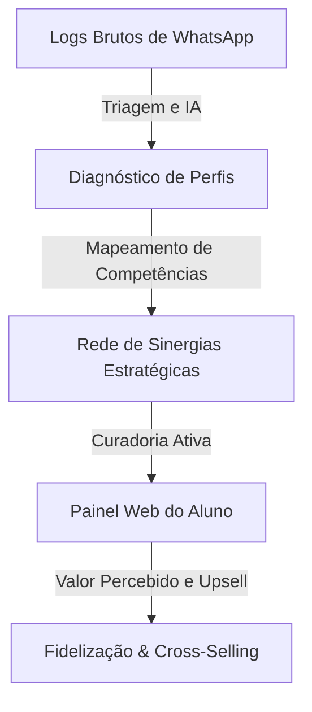

# Comunidade Raio-X: O Método de Gestão, Curadoria Ativa e Conversão para Grupos de WhatsApp & Mentorias

Bem-vindo ao portal metodológico da **Comunidade Raio-X**! 

Este material foi desenhado para mentores, infoprodutores, diretores de produto e gestores de comunidades que operam grupos de WhatsApp como canais de comunicação com alunos. A nossa premissa é simples: **grupos frios representam churn de alunos e dinheiro perdido na mesa. Grupos otimizados geram conexões, autoridade e novos negócios (upsell).**

---

## 🌿 Por que Comunidade Raio-X?

Na maioria das mentorias digitais, o grupo de WhatsApp dos alunos é deixado em segundo plano. Ele se torna uma lista fria, onde apenas o mentor posta anúncios ou onde os alunos trocam conversas desorganizadas, forçando o suporte a apagar spams de forma puramente reativa.

O **Método Raio-X de Comunidades (RX)** inverte essa dinâmica, transformando um canal de mensagens em um ativo estratégico de inteligência corporativa:

---

## 🧭 Os 7 Passos da Metodologia

Navegue pelos passos abaixo para entender e implementar a metodologia:

1. **[01. Diagnóstico da Persona](01_DIAGNOSTICO_PERSONA/PASSO_01_Persona.md)**: Identifique quem tem a dor dos grupos frios e qual o perfil ideal do seu cliente de consultoria.
2. **[02. Jornada do Mentorado](02_JORNADA_MENTORADO/PASSO_02_Jornada.md)**: Desenhe a transformação completa, levando a comunidade do caos à clareza estruturada.
3. **[03. Estrutura e Formato](03_ESTRUTURA_FORMATO/PASSO_03_Estrutura.md)**: Escolha os modelos de empacotamento do produto (Consultoria Premium, Mentoria de Grupo ou Recorrência).
4. **[04. Entrega e Acompanhamento](04_ENTREGA_ACOMPANHAMENTO/PASSO_04_Entrega.md)**: Defina a curadoria ativa (triagens de WhatsApp, resumos pós-Zoom e automações com IA).
5. **[05. Precificação](05_PRECIFICACAO/PASSO_05_Precificacao.md)**: Desenvolva ofertas de alto valor (High Ticket) e contratos recorrentes de manutenção.
6. **[06. Oferta e Naming](06_OFERTA_NAMING/PASSO_06_Oferta.md)**: Defina a copy irresistível, nome do método e a sua promessa de aceleração de comunidades.
7. **[07. Canais de Aquisição](07_ESTRATEGIA_VENDAS/PASSO_07_Vendas.md)**: Estratégias práticas para prospectar clientes por meio de auditorias e diagnósticos gratuitos demonstrativos.

---
&copy; 2026 Comunidade Raio-X. Todos os direitos reservados.
